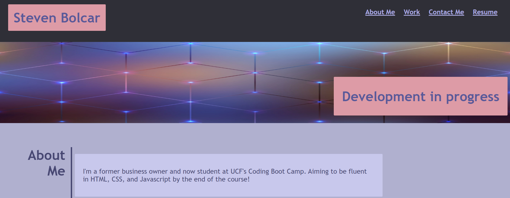

Designing a portfolio webpage

started initial webpage design, modeling it after the example given.
Granted, it was unnecessary to attempt, and gave me a lot of challenge.
I feel that i know a lot more about the CSS side of HTML now, and hopefully I get to refactor my website in the future.

for this project I added basic tags to the HTML, which I later detailed in CSS. I pulled pictures locally and from the internet.

I initially tried consolidating some code in CSS, but it went pretty wrong early on. luckily I was able to fix most of the errors, styled it a different way, and got it functioning properly.

https://github.com/StevenBolc/portfolio-webpage

https://stevenbolc.github.io/portfolio-webpage/

